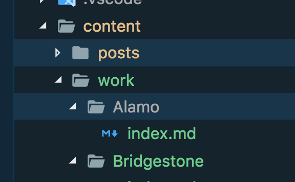

I only recently started using [Gatsby](https://www.gatsbyjs.org/) for my website and as is usually the case, I immediately wanted to make modifications.  I used [Gatsby Material Starter](https://github.com/Vagr9K/gatsby-material-starter) as my starter site and it includes a folder where you can store markdown files for your blog posts, but I needed to showcase my work as well, as that's the main purpose of my site. I could have just kept the static HTML of my recent clients from my old site, cut and paste it into the home page template and been done, but since I wanted to learn more about Gatsby and I thought it would make a good post, I figured out how to add a new post type.  I'm just a couple of weeks into working with [Gatsby](https://www.gatsbyjs.org/), so this may not be the best way, it's just how I did it.  So I'll take you through the steps I did to add the second post type to my site. If you see something I could do differently or better, let me know in the comments.  Here we go..

## Add Another Data Source

First things first, I needed to add the source for my new posts. The starter is already pulling data from markdown files in ```/content/posts``` utilizing [gatsby-source-filesystem](https://www.npmjs.com/package/gatsby-source-filesystem).  I thought I could just add another reference to markdown files in a new directory and I'd reference that in a separate GraphQL query and have a separate array of posts to work with, but that is not how it works. The first part is right, I can just reference another folder, but the files will be returned in the original graphql query along with the original posts. So I added a new folder to my gatsby-source-filesystem options (```/content/work```) and they would now be in the array returned by in the current GraphQL query. All I have to do now is separate them in the presentation components.


I added new folder for my markdown files for each client.

```javascript
// in data/SiteConfig added

workDir: "work", // The name of directory that contains your work.
```

I then added a reference to the work folder in the Starter's SiteConfig.js file to stay with the conventions in place.

```javascript
//in gatsby-config.js under plugins add

    {
      resolve: "gatsby-source-filesystem",
      options: {
        name: "data",
        path: `${__dirname}/content/${config.workDir}`
      }
    },

```

I added the source in gatsby-config.js to the gatsby-source-filesytem options, thus adding the fiels to the current GraphQL query.

## Get Data for New Post Type

Now I needed to separate out the work posts from the blog posts.  The Starter was iterating through the posts already in ```pages/index.js```.  I simply added a filter to the object and created two arrays, one for posts and one for work.

```javascript
// in pages/index.jsx

class Index extends React.Component {
  render() {
    const { edges } = this.props.data.allMarkdownRemark;
    const postEdges = edges.filter(post => {  if (post.node.id.indexOf('/content/posts/') > 0) return post; });
    const workEdges = edges.filter(post => {  if (post.node.id.indexOf('/content/work/') > 0) return post; });
    return (...
```

## Update Sibling Links for only Posts

One last thing we need to change is the generation of post sibling links.  I just want the prev and next links in posts to link to other posts.  I don't want them to include links to my work posts.  So I added a filter in ```gatsby-node.js``` in the addSiblingNodes function to only add sibling links to the original blog posts.

```javascript
// in gatsby-node.js

let postNodes = [];

function addSiblingNodes(createNodeField) {

  postNodes = postNodes.filter(post => {  if (post.id.indexOf('/content/posts/') > 0) return post; });

  postNodes.sort(
    ({ frontmatter: { date: date1 } }, { frontmatter: { date: date2 } }) =>

```

## Add New Components and Template

The starter already traversed a list of posts, so I added a new component that would iterate the new array and display the logo for each.  A new template was added under ```/templates``` for the work detail page.  See my [repo on github](https://github.com/bennewton999/blog2018) for the full source.

## That's It!

So that's it, I now have my work available on my site again as well as a nice set up for adding more info and new work as necessary by adding more markdown files.  Again, I'm just a couple of weeks into working with [Gatsby](https://www.gatsbyjs.org/). I typically don't read the docs until I need to, so if you see something I'm doing and you don't agree, please let me know in the comments. I'm sure there's more than one way to do this and I'd love to hear what you think.  I'm sharing this because I couldn't find a good post when I looked for one myself to work from.